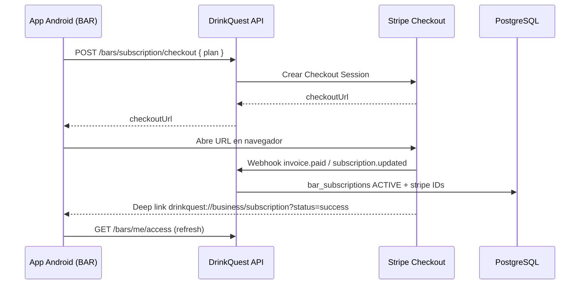

# Stripe — pagos SaaS para bares DrinkQuest

Los dueños de bar contratan o renuevan su plan desde la app Android (vista Negocio → tarjeta **Suscripción** → **Pagar con tarjeta**). Stripe Checkout abre en el navegador y, al terminar, la app vuelve por deep link.

## 1. Cuenta Stripe

1. Crea cuenta en [https://dashboard.stripe.com](https://dashboard.stripe.com).
2. Activa **modo test** para desarrollo.
3. En **Settings → Business** verifica que la moneda incluya **MXN**.

## 2. Productos y precios (3 planes mensuales)

En **Product catalog → Add product**, crea:

| Plan        | Precio mensual | Variable env        |
|-------------|----------------|---------------------|
| Explorer    | $499 MXN       | `STRIPE_PRICE_EXPLORER` |
| Intermedio  | $1,000 MXN     | `STRIPE_PRICE_INTERMEDIATE` |
| Legend      | $1,500 MXN     | `STRIPE_PRICE_LEGEND` |

Cada precio debe ser **Recurring / Monthly**. Copia el **Price ID** (`price_…`) de cada uno.

## 3. Variables de entorno (backend)

En `.env` local o Render:

```env
STRIPE_SECRET_KEY=sk_test_…
STRIPE_WEBHOOK_SECRET=whsec_…
STRIPE_PRICE_EXPLORER=price_…
STRIPE_PRICE_INTERMEDIATE=price_…
STRIPE_PRICE_LEGEND=price_…
STRIPE_CHECKOUT_SUCCESS_URL=drinkquest://business/subscription?status=success&session_id={CHECKOUT_SESSION_ID}
STRIPE_CHECKOUT_CANCEL_URL=drinkquest://business/subscription?status=cancel
```

## 4. Webhook

Endpoint: `POST https://TU-API/api/v1/webhooks/stripe`

Eventos mínimos:

- `checkout.session.completed`
- `customer.subscription.updated`
- `customer.subscription.deleted`
- `invoice.paid`
- `invoice.payment_failed`

**Desarrollo local** con Stripe CLI:

```bash
stripe listen --forward-to localhost:3000/api/v1/webhooks/stripe
```

Copia el `whsec_…` que imprime el CLI a `STRIPE_WEBHOOK_SECRET`.

## 5. Flujo técnico



## 6. Render (producción)

Añade las variables Stripe en el Web Service. Configura el webhook en Stripe Dashboard apuntando a:

`https://drinkquest-api.onrender.com/api/v1/webhooks/stripe`

Tras el primer pago test, verifica en admin que el bar pasa a **ACTIVE** con `stripe_subscription_id` poblado.

## 7. Admin manual (sigue disponible)

Los admins pueden activar planes manualmente (`AdminBarDetailScreen`) para bares piloto o cortesías. Stripe y activación manual comparten la misma tabla `bar_subscriptions`.
